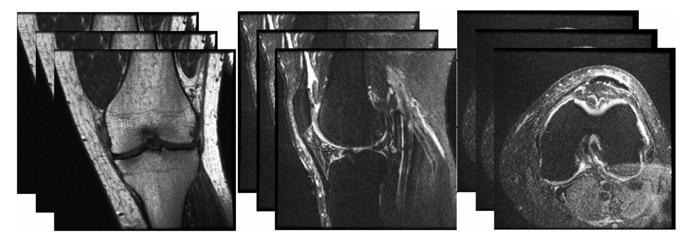

```{r, load_refs, echo=FALSE, cache=FALSE, message=FALSE}
options(scipen = 999)

# xaringan::inf_mr("index.rmd")
library(RefManageR)
BibOptions(
  check.entries = FALSE,
  bib.style = "authoryear",
  cite.style = "authoryear",
  style = "markdown",
  hyperlink = FALSE,
  dashed = FALSE,
  max.names = 1
)
bib <- ReadBib("/home/nicolai/OneDrive/Forskning/Zotero Library/zotero_lib.bib", check = FALSE)
```

class: title-slide
background-image: url("assets/ucph-logo-white-en.svg"), url("assets/suh-white-en.svg"), url("assets/title-knee-mri.jpg")
background-position: 8% 90%, 32% 89%, 100% 50%
background-size: 150px, 180px, 50% 100%
background-color: #0148A4

.pull-left[
<br>
## .text-shadow[.white[Using deep learning to diagnose knee injuries on magnetic resonance images: <br> current potential and limitations]]

### .white[**Nicolai Sandau**, MD <br> Stig Brorson, MD PhD DMSc]
<br>
### .white[Centre for Evidence-Based Orthopedics, Dept. of Orthopedic Surgery,<br>Zealand University Hospital]
]

---

# Background
<br>
.center[
  .middle[

  ]
]

???
In 2018 researchers from stanford released a paper in which they reported their findings on using deep learning to diagnose knee injuries. 

However, the findings were not quite at human performance. 

As deep learning is a rapidly developing field and new techniques are published almost daily we wanted to investigate if these new advances in deep learning could help achieve human level performance.   

---

# Methods: Data

- 1250 cases 
  - Training: 1130 
  - Validation: 120
- Labels with presence of meniscus and/or acl tear

.center[]

???
Kunne lave en illustration af hvordan billederne bare er matrix med numre img -> matrix 
og illusterere at hver serie er = 256*256*30 tal 

---
# Methods: Training the model

* Efficientnet B1 pretrained on imagenet dataset ( $\approx$ 14.000.000 images)

.center[
.middle[
  
]]

---

# Results: ACL 
.center[
.middle[

]
]

---
# Results: Meniscus
.center[
.middle[

]
]

---

# Results: GradCAM

<br>
.center[
  .middle[
    
  ]
]

???
Labels: no acl tear or meniscus tear
---

# Limitations
.Large[
* Generalizability 
  * Patient population 
  * Different scanners
  * "Blind" to other pathologies 
* Lack of high quality data (Pref. intra-operatively verified)
]
---
# Conclusions

.Large[
* Deep learning methods has the potential to aid radiologists and orthopedic surgeons in the diagnosis of meniscus and ACL injuries on MRI. 
* Issssue with generalizability needs to be solved before implementation in clinical practice 
]
---
class: sydney-blue
background-image: url(assets/USydLogo-white.svg)
background-size: 260px
background-position: 5% 95%

# .white[Thank you!]

.pull-right[.pull-down[
Nicolai Sandau, MD <br>
Centre for Evidence-Based Orthopedics, <br> 
Dept. of Orthopedic Surgery, <br>
Zealand University Hospital, <br>
Denmark <br> <br>

<a href="mailto:nicsa@regionsjaelland.dk">
.white[`r fontawesome::fa("paper-plane")` nicsa@regionsjaelland.dk]
</a>

<a href="https://www.researchgate.net/profile/Nicolai_Sandau">
.white[`r fontawesome::fa("link")` researchgate.net/profile/Nicolai_Sandau]
</a>

<br><br>

]]

---

## References

```{r refs, echo=FALSE, results="asis"}
PrintBibliography(bib)
```
