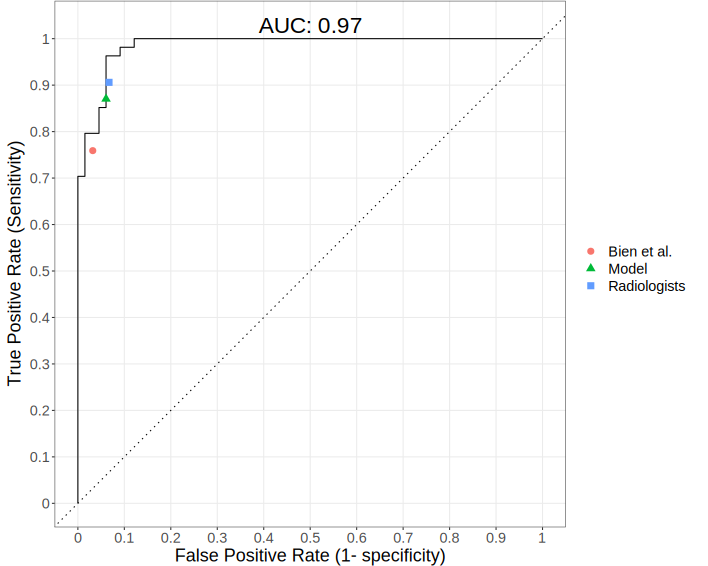

```{r, load_refs, echo=FALSE, cache=FALSE, message=FALSE}
options(scipen = 999)

# xaringan::inf_mr("index.rmd")
```

class: title-slide
background-image: url("assets/ucph-logo-white-en.svg"), url("assets/suh-white-en.svg"), url("assets/title-knee-mri.jpg")
background-position: 8% 90%, 32% 89%, 100% 50%
background-size: 150px, 180px, 50% 100%
background-color: #0148A4

.pull-left[
<br>
## .text-shadow[.white[Using deep learning to diagnose knee injuries on magnetic resonance images: <br> current potential and limitations]]

### .white[**Nicolai Sandau**, MD <br> Stig Brorson, MD PhD DMSc]
<br>
### .white[Centre for Evidence-Based Orthopedics, Dept. of Orthopedic Surgery,<br>Zealand University Hospital]
]

???
Først vil jeg gerne sige tak for muligheden for at komme og fortælle om vores projekt hvor vi har udviklet en deep learning model de havde udviklet til at diagnosticere ACL og menisk skader ud fra MR scanninger. 
---

# Background
<br>
.center[
  .middle[

  ]
]

???
Baggrunden for dette projekt kommer fra en artikel udgivet i 2018 hvor en gruppe fra Stanford præsenterede deres resultater for en deep learning model der kunne diagnosticere ACL og menisk skader ud fra MR billeder. 

I artiklen sammenlignede de deres model med radiologer, men de måtte  konkludere at deres model ikke helt var på niveau med radiologernes.  

Deep learning feltet har de seneste år oplevet en massiv teknologisk udvikling. 
Vi ville med dette projekt derfor undersøge om det ved hjælp af disse fremskridt var muligt at opnå resultater på niveau med radiologer. 

---

# Methods: Data

- 1250 cases 
  - Training: 1130 
  - Validation: 120

.pull-left[
.center[
]]

.pull-right[.center[
  <br>
]]

???
Vi benyttede det samme dataset som de brugte i artiklen fra 2018 som består af i alt 1250 cases.
De 1250 cases er delt op i et trænings sæt og et validerings. 
Valideringssættet benyttes til at teste modellen på et sæt billeder den aldrig har set før. 

Hver case var klassificeret med diagnose af meniskus og/eller acl skader. 

Som man kan se nederst på sliden så er billederne blot en matrix af tal. 
Og grundlæggende så forsøger en deep learning model at finde en transformation af de her tal på en sådan måde at den kan skelne mellem billeder med en skade fra dem uden. 

Så der er lidt forsimplet to måder man kan forbedre sådan en model: 
1. ved at optimere forarbejdelsen af den data som modellen trænes på
2. optimere de transformationer som modellen kan lære, også kaldet arkitekturen af modellen

---
# Methods: Deep learning model

<br>

.center[
.middle[
  
]]

???

Det skal gøres for hvert plan individuelt, således at hver model er trænet i isolation. 
Til sidst kombinerer man så sandsynlighederne fra hvert plan ved hjælp af en simpel logistisk regression og man opnår derefter en vægtet sandsynlighed for at den her patient har en diagnose.  

Det her gjorde vi så for både ACL og for menisk. 
---

# Results: ACL 
<br>

.center[.middle[

]]

???
Idet modellen giver en sandsynlighed for en given diagnose kan man anvende en såkaldt reciever operator curve hvor vi har den sande positiv rate på y-aksen og den falske positiv rate på x-aksen.

Ved at justere hvor sikker modellen skal være på en diagnose kan man justere på de to parametre som illustreret ved den sorte streg. Dvs jo mere sikker modellen skal være nedsætter vi den falske positive rate men det er på bekostning af den sande positive rate. 

Et overordnet mål for præstationen er så arealet under kurven hvor det maksimale er 1, svarende til at man havde en sand positiv rate på 1 og en falsk positiv rate på 0.

Når man beregner sensitivitet og specificity er cut-off normalt 0.5 som for vores model er illustreret med den grønne plet.   

Til sammenligning kan man se modellen fra den førnævnte artikel svt det røde punkt, samt radiologernes resultater fra samme artikel i det blå punkt. 

---
# Results: Meniscus
<br>

.center[.middle[

]]

???
For meniskskader kan vi se at modellen igen er sammenlignelig med radiologernes diagnosticeringsevne. 
---

# Results: GradCAM

<br>

.center[.middle[
    
  ]
]

???
Når modellen træner kan man trække de tal ud som den bruger til at justere sine parametre og overlægge dem som et heatmap på de billeder som den har trænet på for at få et indblik i hvilke regioner modellen tillæger størst vægt og som det kan ses ser det ud til at den har en god ide om hvilke områder der adskiller patienterne med og uden skader. 

Labels: no acl tear or meniscus tear
---

# Limitations
.Large[
* Lack of generalizability 
  * Patient population 
  * Different scanners
  * Other pathologies
* Potential solution: More high quality data
]
???
Som med de fleste andre statistiske modeller, er der dog nogle begrænsninger man skal have in mente hvoraf den største er i forhold til til generaliserbarheden 
Idet modellen kun  kender til de cases den har trænet på skal man sikre sig at de patienter man træner på er fra samme population som den man vil anvende den på. 
Som eksempel var det her dataset fra et amerikansk hospital hvor man kan se at mange har hæmartron sandsynligvis fordi de bliver scannet umiddelbart efter skadens indtræden. 
Modellen kan derfor formentlig ikke direkte overføres her til Danmark, da patienterne formentlig bliver scannet på et senere tidspunkt og færre måske derfor har hæmartron.
Dette gælder også i forhold til anvendelsen af forskellige scannere eller hvis patienterne har andre patologier udover dem som modellen er trænet på.

En potentiel løsning er mere data af høj kvalitet. 
I det her tilfælde med menisk og acl skader er der især behov for intra-operativt verificerede diagnoser, da som vi kunne se, også radiologer tager fejl når de vurderer MR scanninger. 
Og modellen kan kun være så god som den data den har lært fra.  

---
# Conclusions

.Large[
* Deep learning methods has the potential to aid radiologists and orthopedic surgeons in the diagnosis of meniscus and ACL injuries on MRI. 
* More high quality data is needed to improve generalizability.
]

???
Deep learning modeller har potentiale til at kunne bidrage i diagnosticeringen af menisk og acl skader men der er behov for mere højkvalitets data for at sikre generaliserbarheden inden vi kan se det implementeret i klinisk praksis. 

---
class: sydney-blue
background-image: url(assets/USydLogo-white.svg)
background-size: 260px
background-position: 5% 95%

# .white[Thank you!]

.pull-right[.pull-down[
Nicolai Sandau, MD <br>
Centre for Evidence-Based Orthopedics, <br> 
Dept. of Orthopedic Surgery, <br>
Zealand University Hospital, <br>
Denmark <br>
<a href="mailto:nicsa@regionsjaelland.dk">
.white[`r fontawesome::fa("paper-plane")` nicsa@regionsjaelland.dk]
</a>

<br><br>

]]

