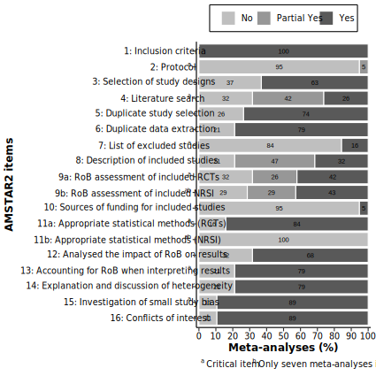
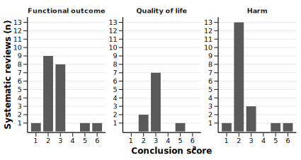

```{r, load_refs, echo=FALSE, cache=FALSE, message=FALSE}
# xaringan::inf_mr("index.rmd")
library(RefManageR)
BibOptions(
  check.entries = FALSE,
  bib.style = "authoryear",
  cite.style = "authoryear",
  style = "markdown",
  hyperlink = FALSE,
  dashed = FALSE,
  max.names = 1
)
bib <- ReadBib("/home/nicolai/OneDrive/Forskning/Zotero Library/zotero_lib.bib", check = FALSE)
```

class: title-slide
background-image: url("assets/unsw-white.svg"), url("assets/cochrane-white.svg"),  url("assets/ucph-logo-white-en.svg"), url("assets/suh-white-en.svg"), url("assets/title-phf.jpeg")
background-position: 8% 83%, 8% 95%, 32% 83%, 32% 95%, 100% 50%
background-size: 100px, 100px, 150px, 150px, 50% 100%
background-color: #0148A4

.pull-left[
<br>
##.text-shadow[.white[The methodological quality was low and conclusions discordant for meta-analyses comparing proximal humerus fracture treatments: <br> a meta-epidemiological study]]

### .white[**Nicolai Sandau**, MD<br> Peter Buxbom, MD PhD<br> Asbjørn Hróbjartsson, MD PhD<br>Ian Harris, MBBS PhD <br> Stig Brorson, MD PhD DMSc]
]

---

# Background
<br>

.middle[
.pull-left[
   
   `r Citet(bib, "duInterventionsTreating4part2017")`]
  
  .pull-right[
    
    `r Citet(bib, "beksOperativeNonoperativeTreatment2018")`
  ]
]

---
# Methods
.large[
- Searched EMBASE, PubMed, The Cochrane Library, and Web of Science for meta-analyses comparing non-operative with operative treatments
- Assessed methodological quality using AMSTAR2
- Scored the reported conclusions for three outcome domains: <br> functional outcome, quality of life and adverse events. 
  - Scale ranged from 1-6
      - 1: Highly favoring non-operative intervention
      - 6: Highly favoring operative intervention
]
---

# Results: Publications
.center[
.middle[

]]
---

# Results: Methodological Quality
.center[
.middle[

]]
---

# Results: Reported Conclusions
.center[
.middle[

]]

---
# Conclusions
<br> <br>
.large[
* The methodological quality of meta-analyses comparing operative with non-operative treatments for proximal humerus fractures is critically low and the reported conclusions are discordant. 
* It was not possible to determine a cause for the discordant conclusions.
]
---
class: sydney-blue
background-image: url(assets/USydLogo-white.svg)
background-size: 260px
background-position: 5% 95%

# .white[Thank you!]

.pull-right[.pull-down[
Nicolai Sandau, MD <br>
Centre for Evidence-Based Orthopedics, <br> 
Dept. of Orthopedic Surgery, <br>
Zealand University Hospital, <br>
Denmark <br> <br>

<a href="mailto:nicsa@regionsjaelland.dk">
.white[`r fontawesome::fa("paper-plane")` nicsa@regionsjaelland.dk]
</a>

<a href="https://www.researchgate.net/profile/Nicolai_Sandau">
.white[`r fontawesome::fa("link")` researchgate.net/profile/Nicolai_Sandau]
</a>

<br><br>

]]

---

## References

```{r refs, echo=FALSE, results="asis"}
PrintBibliography(bib)
```
