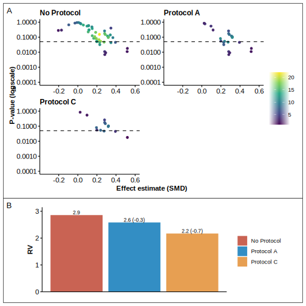

```{r, load_refs, echo=FALSE, cache=FALSE, message=FALSE}
library(RefManageR)
BibOptions(
  check.entries = FALSE,
  bib.style = "authoryear",
  cite.style = "authoryear",
  style = "markdown",
  hyperlink = FALSE,
  dashed = FALSE,
  max.names = 1
)
bib <- ReadBib("/home/nicolai/OneDrive/Forskning/Zotero Library/zotero_lib.bib", check = FALSE)

# xaringan::inf_mr("index.Rmd")
```

class: title-slide
background-image: url("assets/ucph-logo-white-en.svg"), url("assets/suh-white-en.svg"), url("assets/phf.jpeg")
background-position: 8% 90%, 32% 89%, 100% 50%
background-size: 180px, 180px, 50% 100%
background-color: #0148A4

.pull-left[
# .text-shadow[.white[Conflicting Conclusions of Meta-analyses Comparing Operative with Non-Operative Treatments for Proximal Humerus Fractures]]

### .white[Nicolai Sandau, MD]

### .white[Centre for Evidence-Based Orthopedics]
]

???

Good morning, my name is Nicolai, I'm a PhD student at centre for evidence based orthopedics. 
Im here to present  some of the results that we have obtained during  my phd studies so far. 

And as the title of my talk suggests, the aim of my PhD is to investigate how meta-analyses comparing operative with non-operative interventions for the treatment of proximal humerus fractures can end up reporting discordant conclusions. 

---
# Background
<br>

.middle[
.pull-left[
   
   `r Citet(bib, "duInterventionsTreating4part2017")`]
  
  .pull-right[
    
    `r Citet(bib, "beksOperativeNonoperativeTreatment2018")`
  ]
]

???
This study aim was motivated by, among other things, this example from two meta-analyzes that have been published with only a single year apart - but which come to very different conclusions - with one concluding that reverse is the optimal treatment method while the other recommends non- surgical treatment.

It should be mentioned that no new RCTs were published between the publication of the two meta-analyzes - so no new results have been obtained.

---
# Study 1
.center[
.middle[

]]


???
With our first study, we wanted to map the quality and the conclusions of these meta-analyze.
This would also allow us to investigate if meta-analyses of low quality concluded differently than those with high quality. 

We did this by conducting a comprehensive search to include all meta-analyzes that compared non-operative with operative treatments. 
We then graded the quality and scored the reported conclusions. 

---

# Meta-analyses included
.center[
.middle[

]]

???
and as you can see on this figure - where the black line is the meta-analyzes - we ended up including 21 published meta-analyzes that compares operative with non-operative treatment.

By comparison, the gray curve shows that only a total of 8 RCTs have been released, with the latest one being released in 2015.
---

# Methodological Quality
.center[
.middle[

]]

???
After including the meta-analyses, we graded their methodological quality with a tool called AMSTAR2 - which consists of the 16 quality markers shown here.
Based on the 16 markers, each meta-analysis is given an overall assessment.

If you look at the figure, for some items almost all meta-analyzes had shortcomings - especially item 2 where 95% lacked a protocol, item 10 in relation to stating how the included studies were financed, and item 11 where all the meta analyzes that also included retrospective studies had used inadequate statistical methods.

Based on this, only one meta-analysis was assessed to have high quality, while the others were assessed to have critically low quality.

---

# Reported Conclusions
.center[
.middle[

]]

???
Then, we scored the reported conclusions for each meta-analysis for functional outcome, quality of life, and harms.
And as one can see, the conclusions were conflicting for all three outcome domains.

---
# Study 1 Conclusions
<br>
.Large[
* Critically low quality 
* Conclusions were discordant
* Not able to identify reasons for discordant conclusions 
* Lack of pre-defined protocols
]

???
So our conclusion on study 1 was that the quality was overall low and the conclusions conflicting.

We were not able to identify any direct causes for the discordant conclusions. 

A inspired our next study was the lack of observed lack of protocols. 


---

class: center 
<br> <br>

## Pre-defined protocols reduce the analytical flexibility of meta-analyses comparing proximal humerus fracture treatments

#### Nicolai Sandau MD<sup>1</sup>, Thomas Vedste Aagaard MSc<sup>1</sup>, Asbjørn Hróbjartsson MD PhD<sup>2</sup>,<br>Ian Harris MBBS PhD<sup>3</sup>, Stig Brorson MD PhD DMSc<sup>1</sup>

.small[<sup>1</sup>Centre for Evidence-Based Orthopedics, Zealand University Hospital   
<sup>2</sup>Centre for Evidence-Based Medicine Odense and Cochrane Denmark   
<sup>3</sup>Whitlam Orthopaedic Research Centre, University of New South Wales
]

???
We hypothesized that a lack of protocol meant that the authors had a high analytical flexibility thereby giving the authors a high degree of analytical flexibility - meaning they could try out multiple analytical scenarios until they found a statistically significant result or a resulta that  which in turn could result in the reporting of discordant conclusions.  

In theory, a pre-defined protocol should reduce this analytical flexibility, but very few studies have actually investigated if, and by how much, pre-defined protocols can limit the analytical flexibility. 

So that is what we set out to study. 
---

# Vibration of Effects
<br>
.center[
.middle[

]]

???
To quantify analytical flexibility we used a framework called Vibration of Effects, which is best explained with an example. 

If we assume this is our little meta-analysis where we only have 3 different choices, each with 2 options each, it gives us 8 potentially different results.

Vibrations of effect describe how large the difference between the obtained results are. 
So if all the results, despite the different method choices, are close to each other, the vibration of effect is low while if they are very different it is high.

In order to calculate the vibrations of effects, one will have to perform a meta-analysis for all combinations of method choices. 
Ie. you make an algorithm that first does ~ this ~ meta-analysis, then this, etc.

But in reality, there are significantly more choices than illustrated here, so based on the meta-analyzes we included in the first study, we identified 21 method choices that had between 2 and 6 choices - which ultimately yielded just about 400 million unique methodological scenarios.

---
# Results: Functional Outcome

.center[
.middle[

]]


???
The first calculations we ran were without using any protocol as shown in the upper left corner of panel A.

Each point corresponds to a meta-analysis, with the effect estimate on the x-axis where 0 means no difference between operative and non-operative treatment, negative values ​​are in favor of operative while positive are in favor of non-operative.
On the y-axis we have the p-value and everything below the dotted line are significant results.

So one thing you can see is that if you do not use a protocol for functional outcome, you have the opportunity to adapt your method choices so that you can either get a significant result in favor of surgery or for non-operative treatment.

We then contacted the authors of all the meta-analyzes and asked if they had a pre-defined protocol before starting their meta-analysis and we could get a copy.
We then recoded our algorithm to follow the protocols for the method choices specified in the protocol, while the remaining ones that were not mentioned we left as if there was no protocol.

As you can see, a protocol has a great effect on both the number of potential meta-analyzes but also how much spread there is on the results - ie it reduces the vibration of effects.
However, with Protocol A it was still possible to achieve conflicting results (protocol A) when using different methodological scenarios.

---

# Results: Quality of Life
.center[
.middle[

]]

???
For quality of life, the effect is the same, however less pronounced than for functional outcome as there are fewer studies reporting on quality of life.

---
# Results: Adverse Events

.center[
.middle[

]]

???
For adverse events, the protocols has some effect but it is still possible to obtain relative risks that differs by up to a factor of 20. 


---
# Conclusions:
<br>
* The analytical flexibility was the highest without a protocol for all three outcome domains.
* Pre-defined protocols can reduce the analytical flexibility of meta-analyses, but the effect varies for outcome domains.

---
class: sydney-blue
background-image: url(assets/USydLogo-white.svg)
background-size: 260px
background-position: 5% 95%

# .white[Thank you!]

.pull-right[.pull-down[
Nicolai Sandau, MD <br>
Centre for Evidence-Based Orthopedics, <br> 
Dept. of Orthopedic Surgery, <br>
Zealand University Hospital, <br>
Denmark <br>
<a href="mailto:nicsa@regionsjaelland.dk">
.white[`r fontawesome::fa("paper-plane")` nicsa@regionsjaelland.dk]
</a>

<br><br>

]]


---
# References

```{r refs, echo=FALSE, results="asis"}
PrintBibliography(bib)
```
