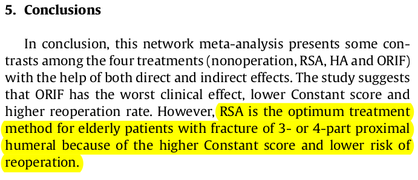

class: middle
```{r setup, include=FALSE}
options(htmltools.dir.version = FALSE)
library(xaringanthemer)
library(tidyverse)
library(flextable)
style_duo(
  primary_color = "#ffffff", secondary_color = "#000000",
  header_font_google = google_font("IBM Plex Sans", "700"),
  text_font_google = google_font("IBM Plex Sans Condensed"),
  code_font_google = google_font("IBM Plex Mono")
)

## CITATIONS
library(RefManageR)
BibOptions(
  check.entries = FALSE,
  bib.style = "authoryear",
  style = "markdown",
  hyperlink = FALSE,
  dashed = T,
  max.names = 1
)
bib <- ReadBib("/home/nicolai/OneDrive/Forskning/Zotero Library/zotero_lib.bib", check = FALSE)


# Documentation
# https://github.com/yihui/xaringan/blob/master/inst/rmarkdown/templates/xaringan/skeleton/skeleton.Rmd


## TESTEER
```

.center[# FIKS CITATIONS]

.pull-left[
   
   `r Citet(bib, "duInterventionsTreating4part2017")`]
  
  .pull-right[
    
    `r Citet(bib, "beksOperativeNonoperativeTreatment2018")`
  ]

---

class: center middle
### Low methodological quality and discordant conclusions of meta-analyses comparing operative and non-operative treatments for proximal humeral fractures
#### Nicolai Sandau MD<sup>1</sup>, Peter Buxbom MD PhD<sup>1</sup>, Asbjørn Hróbjartsson MD PhD<sup>2</sup>,<br>Ian Harris MBBS PhD<sup>3</sup>, Stig Brorson MD PhD DMSc<sup>1</sup>

<sup>1</sup>Centre for Evidence-Based Orthopedics, Department of Orthopedic Surgery, Zealand University Hospital

<sup>2</sup>Centre for Evidence-Based Medicine Odense and Cochrane Denmark

<sup>3</sup>Whitlam Orthopaedic Research Centre, University of New South Wales

---
class: middle, center


---
class: center, middle


---
class: middle center


---
class: center 
### Using deep learning to diagnose knee injuries on magnetic resonance images: current potential and limitations

#### Nicolai Sandau MD, Stig Brorson MD PhD DMSc


---
class: center middle


---
# References

```{r refs, echo=FALSE, results="asis"}
PrintBibliography(bib)
```
