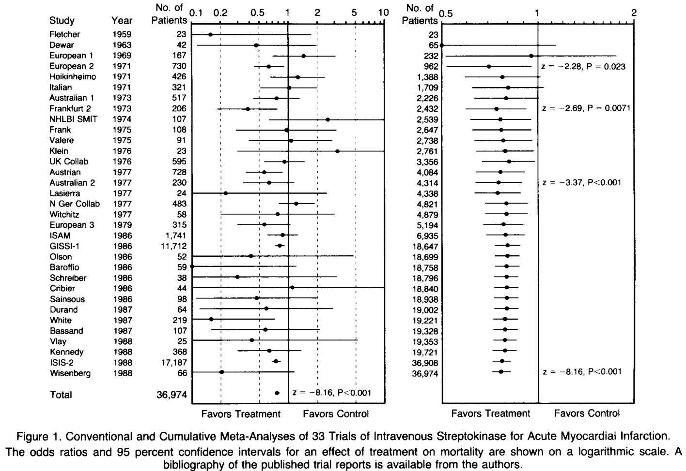
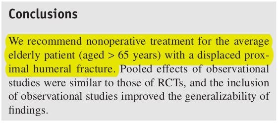
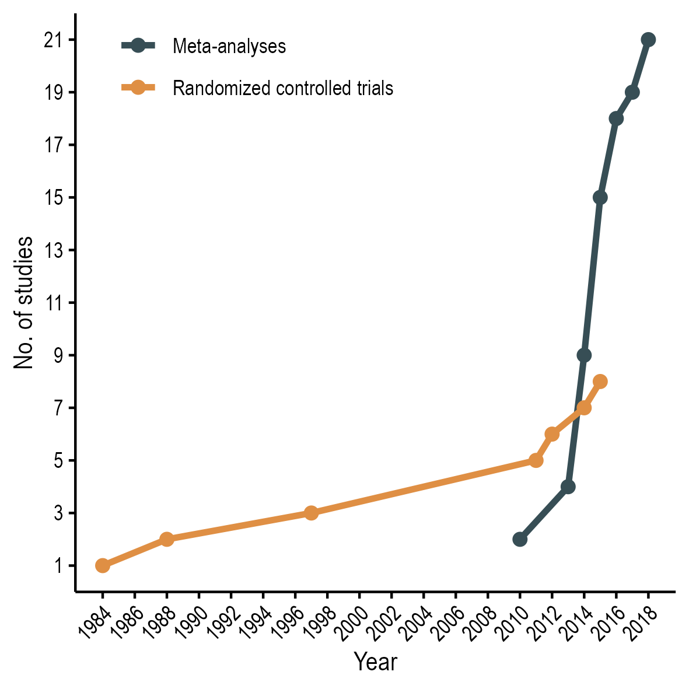
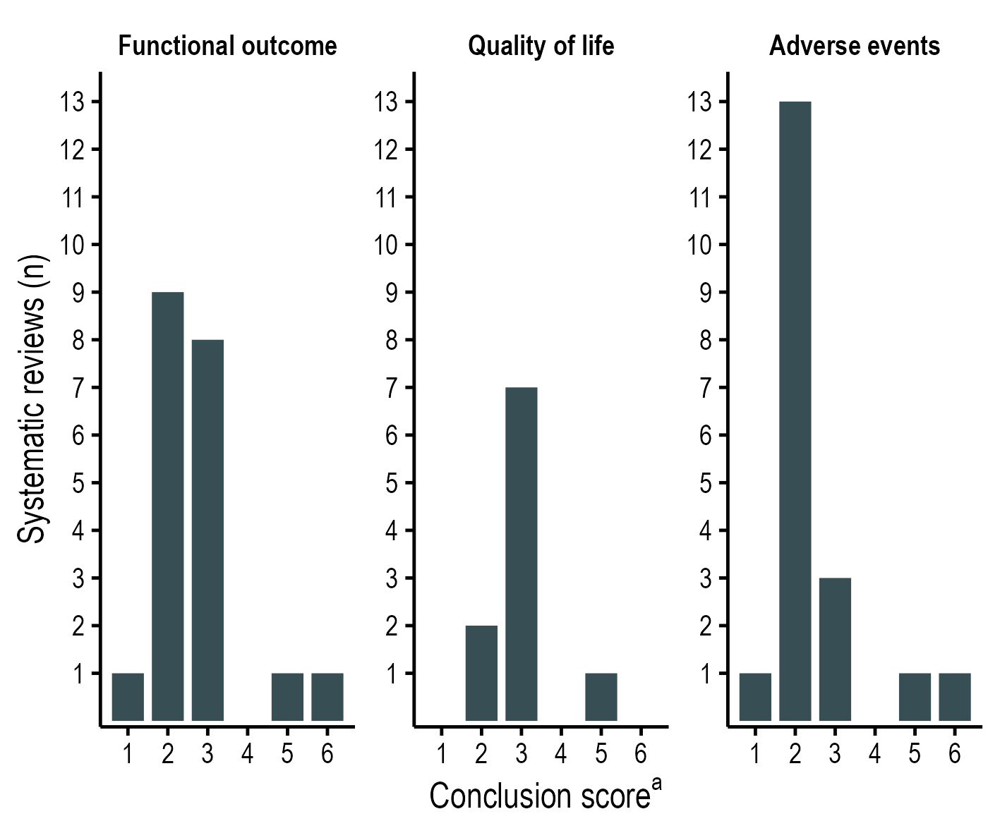
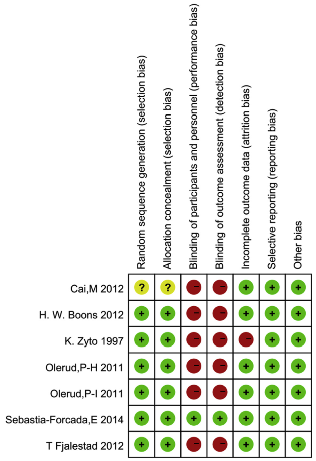
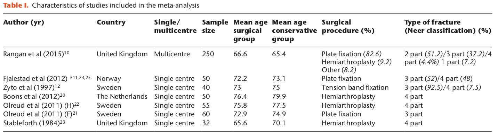
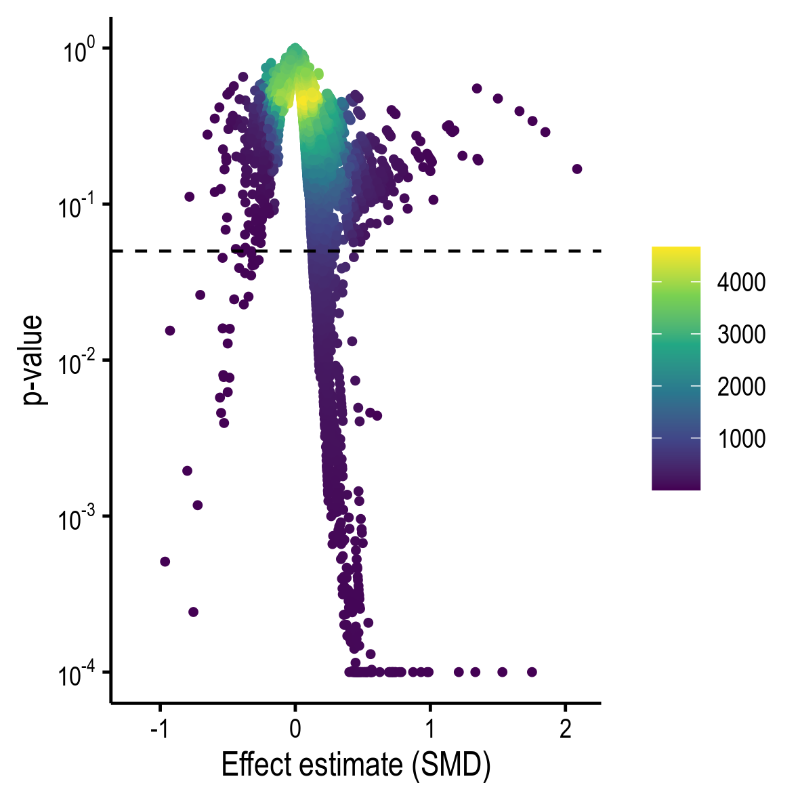
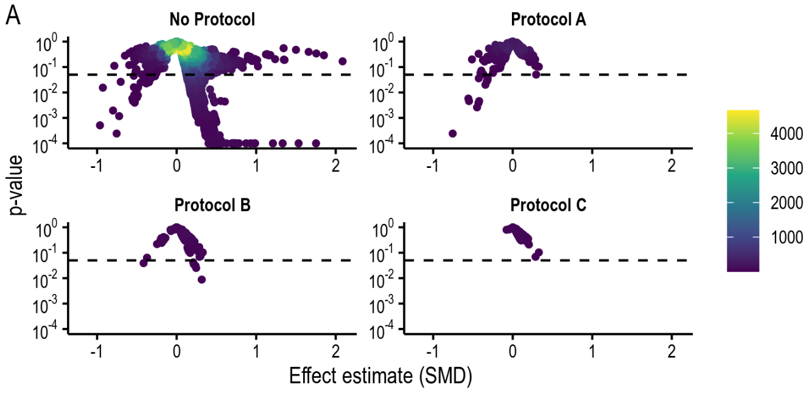
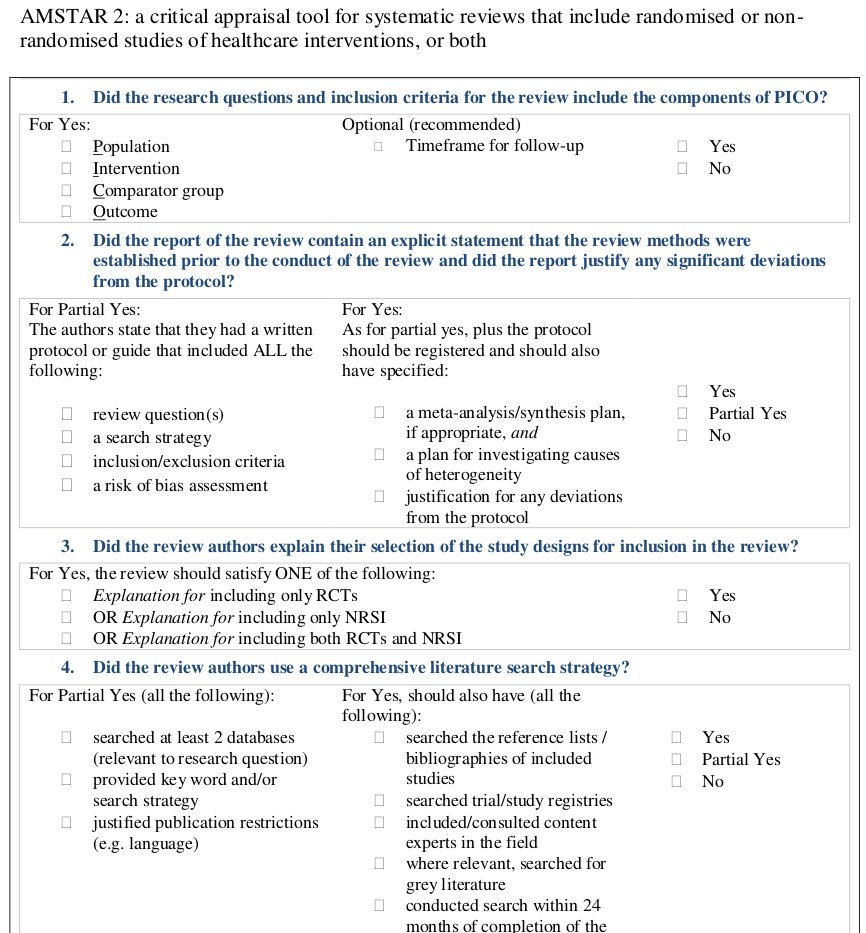

```{r, load_refs, echo=FALSE, cache=FALSE, message=FALSE}
# xaringan::inf_mr("index.rmd")
```

class: title-slide
background-image: url("assets/ucph-logo-white-en.svg"), url("assets/suh-logo-white.png"), url("figures/forest_plot_example.png")
background-position: 8% 90%, 32% 89%, 100% 50%
background-size: 180px, 180px, 50% 100%
background-color: #0148A4

.pull-left[
# .text-shadow[.white[Meta-analyser: Muligheder og begrænsninger]]


<br><br><br>

### .white[Nicolai Sandau]

### .white[Centre for Evidence-Based Orthopedics]
]

---
# Muligheder
<br>

* .Large[Kombinere resultater fra flere studier]
* .Large[Øget sample size]
  * .Large[Øget power] 
  * .Large[Øget precision af effekt estimat]

---

.center[.middle[

]]

---

# Hvordan beregnes en meta-analyse?

* .Large[Vægtet gennemsnit af resultater]
<br> <br>  


$$estimat = \frac{resultat1 \times w1 + resultat2 \times w2}{w1 + w2} $$


* .Large[Vægt beregnes ved inverse-variance]
<br>
$$w = \frac{1}{SE^2}$$ 


---


# Udfordringer og begrænsninger

<br>
<br>

.pull-left[
   ]
  
  .pull-right[
    
  ]


---
# Publicerede meta-analyser
.center[.middle[

]]

---
# Rapporterede konklusioner

.center[.middle[

]]

---

# Udfordringer og begrænsninger

<br>

* .Large[Risk of bias]
* .Large[Heterogenitet]
* .Large[Analytisk frihed]

---

# Risk of bias 

.center[]


---

# Heterogenitet
* .Large[Sammenligneligheden af de inkluderede studier]
  * Forskelle i patienter, interventioner, outcomes, kirurgisk erfaring, genoptræning osv. ?
  * Forskelle i studietyper (RCT vs observationelle studier)
* .Large[Kan estimeres og til dels korrigeres statistisk]

.center[.middle[

]
]


---
# Analytisk frihed

.pull-left[
* .large[Hvilke patienter?]
  * Alder?
  * Frakturtype?
* .large[Hvilke interventioner og comparators?]
  * ORIF vs non-operativt?
  * ORIF + artroplastik vs non-operativ?
]

.pull-right[
* .large[Hvilke outcomes?]
  * Funktionelt outcome? 
  * Quality of life?
  * Adverse events?
  * Hvor lang tids follow-up?
* .large[Hvilke type af studier?]
  * Kun RCTs?
  * RCTs + observationelle?
]
---

<br>

.center[

]

---

<br>

.center[

]

---

# AMSTAR2

.center[
  .middle[

]
]

---
class: sydney-blue
background-image: url(assets/USydLogo-white.svg)
background-size: 260px
background-position: 5% 95%

# .white[Thank you!]

.pull-right[.pull-down[
Nicolai Sandau, MD <br>
Centre for Evidence-Based Orthopedics, <br> 
Dept. of Orthopedic Surgery, <br>
Zealand University Hospital, <br>
Denmark <br> <br>

<a href="mailto:nicsa@regionsjaelland.dk">
.white[`r fontawesome::fa("paper-plane")` nicsa@regionsjaelland.dk]
</a>


<br><br>

]]

