```{r, load_refs, echo=FALSE, cache=FALSE, message=FALSE}

# xaringan::inf_mr("index.rmd")
```

class: title-slide
background-image: url("assets/ucph-logo-white-en.svg"), url("assets/suh-white-en.svg"), url("assets/phf.jpeg")
background-position: 8% 90%, 32% 90%, 100% 50%
background-size: 180px, 180px, 50% 100%
background-color: #0148A4

.pull-left[
# .text-shadow[.white[Assessing the assumptions and results of network meta-analyses comparing treatments for proximal humerus fractures]]
### .white[.small[Nicolai Sandau, BSc MD]]

]

---
# Background
.center[
.middle[
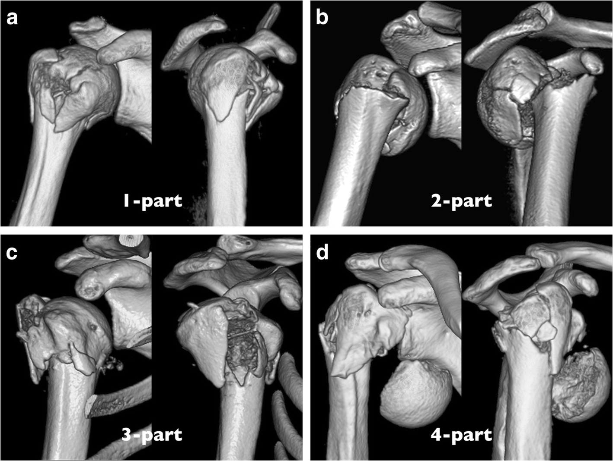
]
]

::: {.notes}
- osteoporosis pathognomic 
- high incidence
- predominantly in women
:::

---
# Background
.center[
.middle[
  <br>
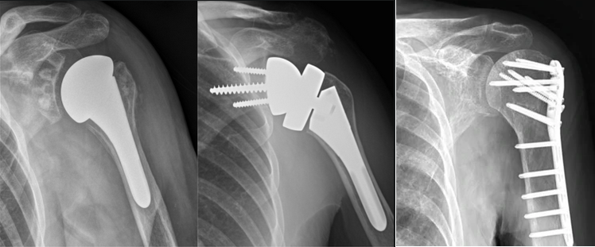
]
]

::: {.notes}
* 4 interventions generally used (3 surgical one non-operative)
* Lack of consensus
* Large geographical differences in usage -> us study
* PHILOS often used in younger patients with less complicated fractures
:::


---
# Background

.center[
  
  ]

.center[
  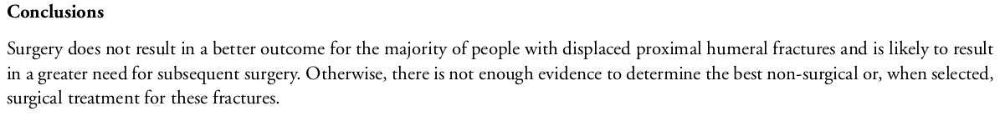
  ]


::: {.notes}
Stigs review concludes no benefit of surgery. 
and not enough evidence to rank interventions.  
:::
---
# Background
.center[
.middle[
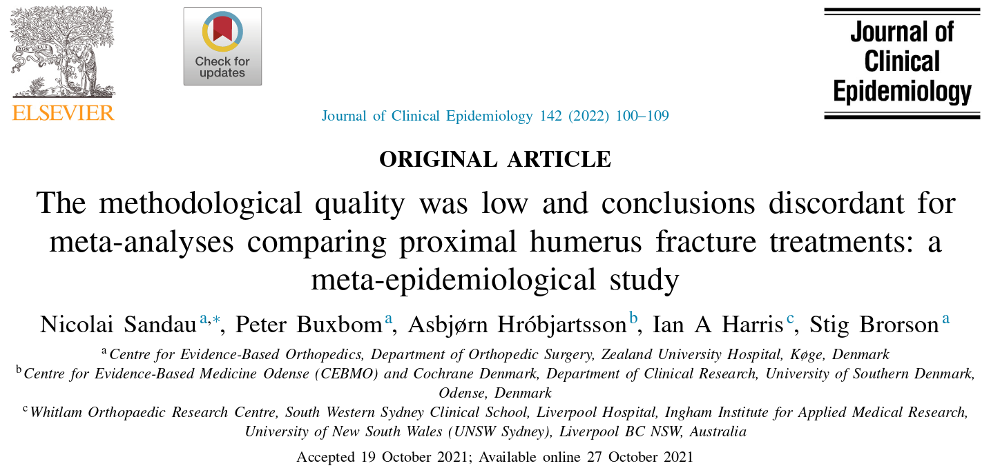
]]

::: {.notes}
In the first study we identified 2 NMA's reporting conclusions in favor of RSA, despite using the same trials as in the Cochrane review. 
Despite only 8 available RCTs and only one of these (n = 61) comparing RSA with another intervention. 
:::
---
# Background
.center[
.middle[
Chen et al. 2016

  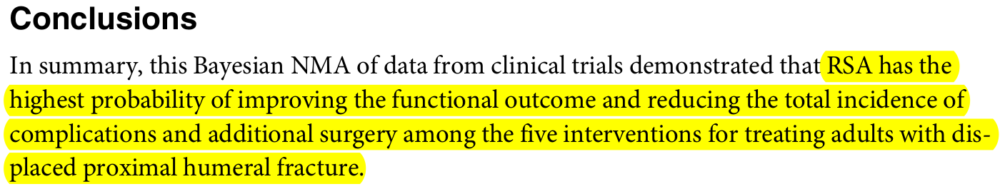

Du et al 2017

   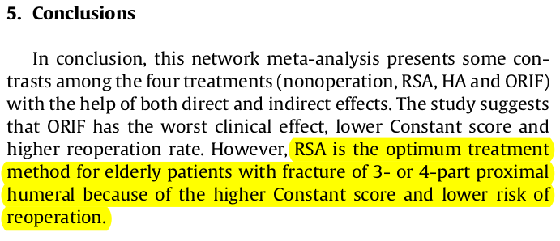
]
]
---
# Background

.center[
.middle[
Orman et al. 2020

   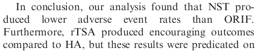

  <br>
Davey et al. 2021  
 .pull-left[
  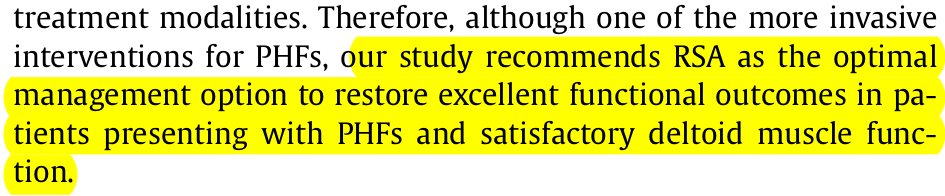
 ]
 .pull-right[
  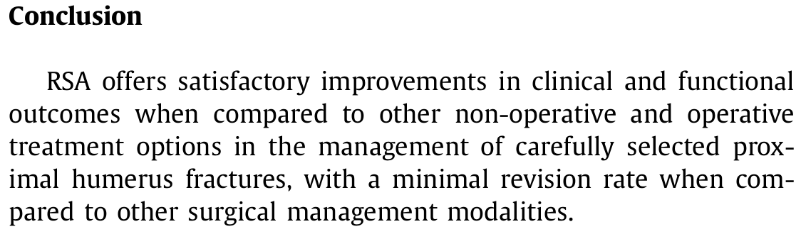]

]
]

---
# Aim

<br>
.Large[
* To assess whether network meta-analyses comparing interventions for proximal humerus fractures provide trustworthy estimates of intervention effects and ranking of interventions.]


---
# Methods
.Large[
* Core assumptions
   * Transitivity and coherence 
* Confidence in results
   * Critical appraisal of methods
   * CINeMA
]

---
# Methods: Transitivity 

.center[
.middle[
   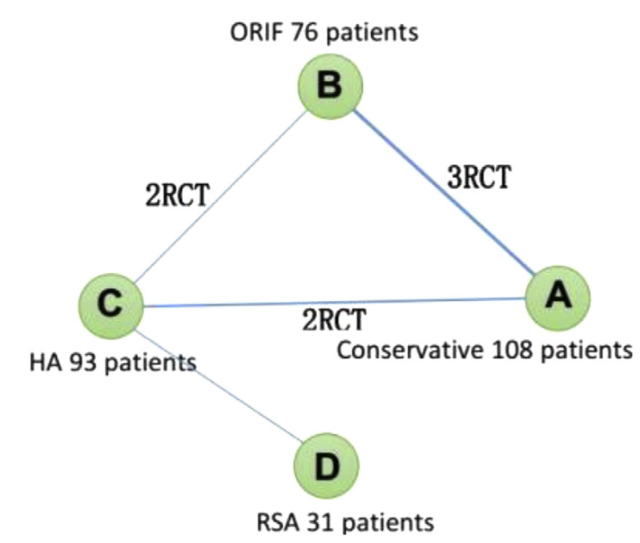
]
]

::: {.notes}

* Potential effect modifiers should be evenly distributed among treatment comparisons. 

Potential effect modifiers: 
* Age 
* Gender
* Fracture severity
:::

---
# Methods: Coherence

* Node splitting

.center[
.middle[
   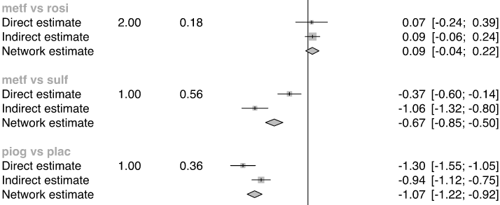
]
]

* Design-by-treatment interaction test

::: {.notes}
* Low power 
* Local approach requires both direct and indirect evidence
:::

---
# Methods: Critical appraisal of methodology

.center[
.middle[
   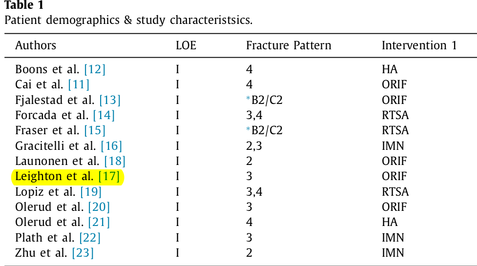
]
]

---
# Methods: Critical appraisal of methodology

.center[
.middle[
   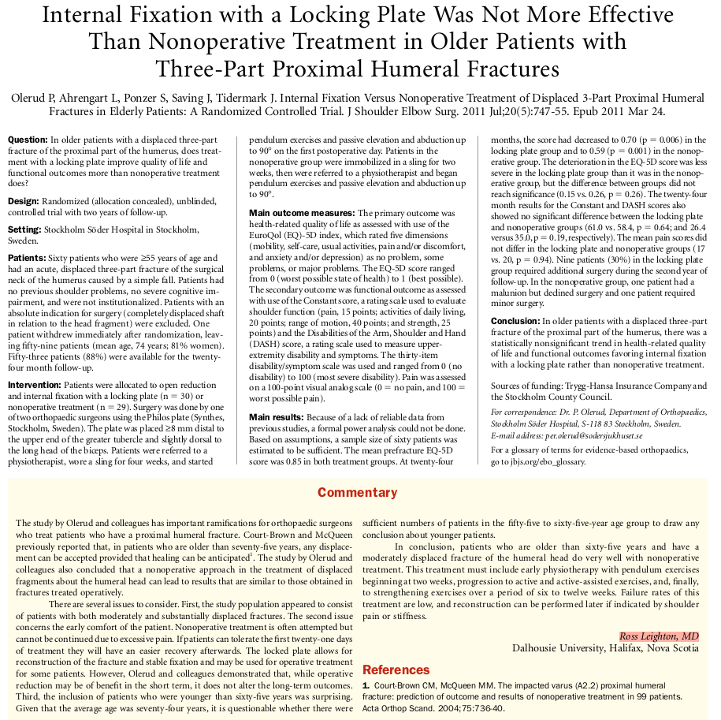
]
]

---
# Methods: CINeMA
<br>
.center[
.middle[
   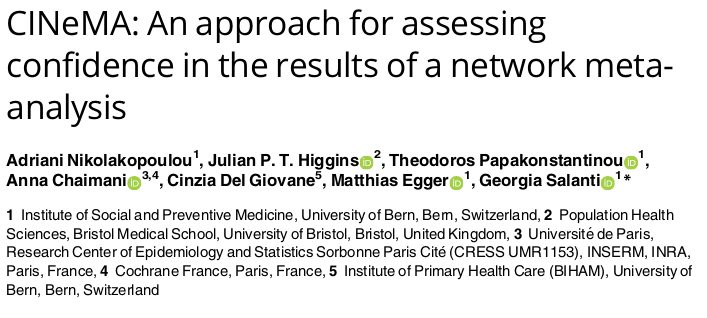
]
]

::: {.notes}

* within-study risk of bias
* reporting bias 
* indirectness
* imprecision
* heterogeneity 
* incoherence

:::
---
# Methods: CINeMA
.center[
.middle[
   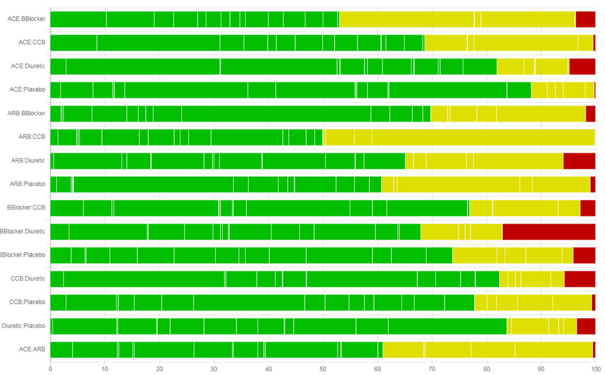
]
]

---
# Methods: CINeMA
.center[
.middle[
   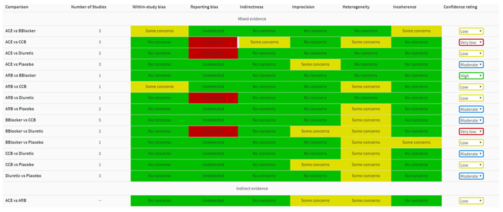
]
]

::: {.notes}
* Imprecision: if CI overlaps MCID zone in both directions
* Heterogeneity: Differences in CI vs prediction intervals
:::

---
# Talking points 

.Large[
* Alternative approaches?
* Other tools / frameworks? 
* Other methodological issues to consider?
]
